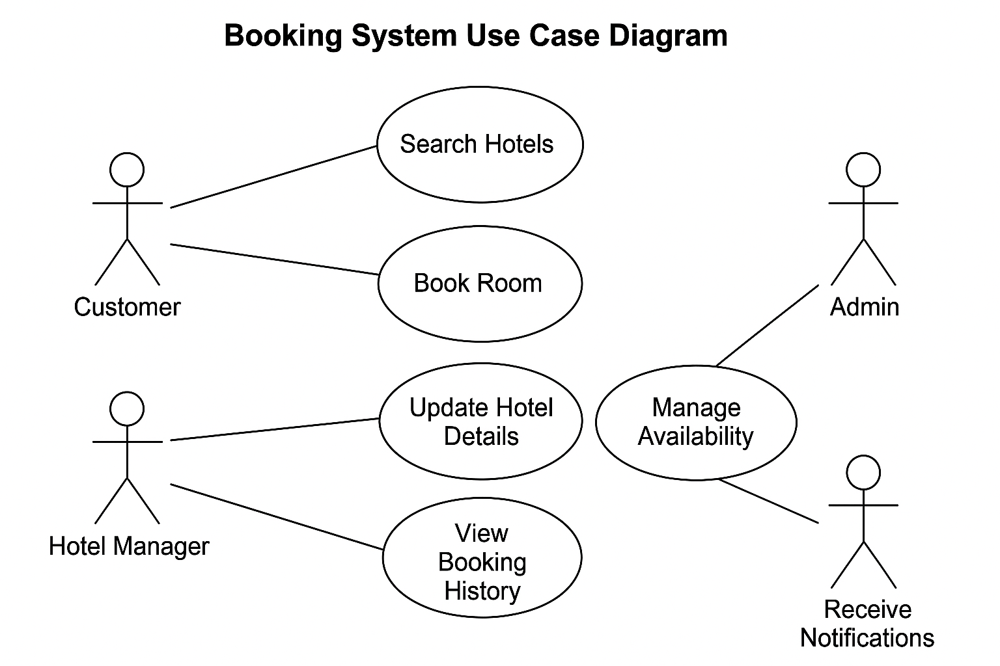

# Requirement Analysis in Software Development
The purpose of this repository is to demonstrate how to clearly structure, document, and present software requirements to ensure that development teams build products that meet user and stakeholder needs.

## What is Requirement Analysis?
Requirement Analysis is the process of identifying, gathering, and clearly defining what a software system should achieve. It involves working closely with stakeholders and users to understand their needs and expectations.

This phase ensures that all requirements are well-documented and agreed upon before development starts. A thorough requirement analysis reduces misunderstandings, aligns the project with business goals, and helps deliver a product that truly meets user needs.

## Why is Requirement Analysis Important?

Requirement Analysis is a critical step in the Software Development Life Cycle (SDLC) for several reasons:

1. **Clarity and Shared Understanding** It ensures that everyone involved in the project — developers, designers, stakeholders, and clients — has a clear understanding of what the software should do. This reduces misunderstandings and prevents costly mistakes later in the project.

2. **Alignment with Business Goals** By clearly defining requirements, the development team can build a product that directly supports the business objectives and adds value for users. This ensures the final solution is relevant, useful, and successful.

3. **Reduced Risks and Improved Quality** Identifying potential issues and ambiguities early makes it easier to address them before development starts. This improves overall software quality, helps avoid rework, and saves time and costs during later stages.

## Key Activities in Requirement Analysis

The Requirement Analysis phase includes several key activities that ensure software requirements are clearly understood, documented, and validated before development begins:

- **Requirement Gathering:** Collecting information from stakeholders, users, and other relevant parties to understand their needs and expectations. This can be done through interviews, surveys, workshops, and observations.

- **Requirement Elicitation:** Clarifying and refining the gathered requirements to uncover hidden needs or conflicting requirements. Techniques include brainstorming sessions, prototyping, and creating user stories or use cases.

- **Requirement Documentation:** Creating detailed documentation that clearly describes all functional and non-functional requirements. This serves as a reference for the development team throughout the project.

- **Requirement Analysis and Modeling:** Analyzing requirements to ensure they are complete, consistent, and feasible. This may involve breaking down complex requirements and using diagrams or models to visualize system interactions.

- **Requirement Validation:** Ensuring that the documented requirements accurately represent stakeholder needs. This often involves reviews, walkthroughs, prototyping, or user testing to confirm correctness and completeness.

## Types of Requirements

There are two main types of requirements identified during requirement analysis:

**Functional Requirements:** These define the specific tasks or functions that the software system must be able to perform. They describe the main features and services that the system offers.

Examples:
- Hotel management features for property owners and managers.
- Customer-facing services, such as browsing and booking rooms.
- Viewing and managing booking history.
- Sending notifications to users.
- Generating reports and analytics for business insights.

**Non-Functional Requirements:** These describe how the system should operate rather than what it should do. They focus on the quality attributes and constraints of the system.

Examples:
- System performance and speed.
- Strong security and data protection.
- Fast response time (low latency).
- Ease of maintenance and updates.
- Ability to scale and remain available under heavy usage.

## Use Case Diagrams

Use Case Diagrams are visual representations that show how different users (actors) interact with a system. They help to clearly define the system's functional requirements and make it easier to communicate with stakeholders.  

**Benefits of Use Case Diagrams:**
- Provide a simple and intuitive way to understand system behavior.
- Help identify different user roles and their interactions with the system.
- Support validation of requirements with stakeholders early in the development process.

## Acceptance Criteria

Acceptance Criteria are specific conditions or requirements that must be met for a feature or functionality to be considered complete and acceptable by stakeholders. They help ensure that all parties have a clear, shared understanding of what "done" means for each requirement.

**Importance of Acceptance Criteria:**
- Provide clear expectations for developers, testers, and stakeholders.
- Serve as a basis for writing test cases and performing validations.
- Help avoid misunderstandings and reduce the risk of incomplete or incorrect implementations.
- Ensure that the final product meets user needs and business objectives.

**Example: Checkout Feature in Booking Management System**

Acceptance Criteria:
- The user can review their booking details (room type, dates, total price) before confirming checkout.
- The user must be able to choose a preferred payment method (e.g., credit card, PayPal).
- The system should securely process and validate the payment information.
- After a successful payment, the user receives a booking confirmation on the website and via email.
- The booking status is updated in the user's account and in the hotel's management system.
